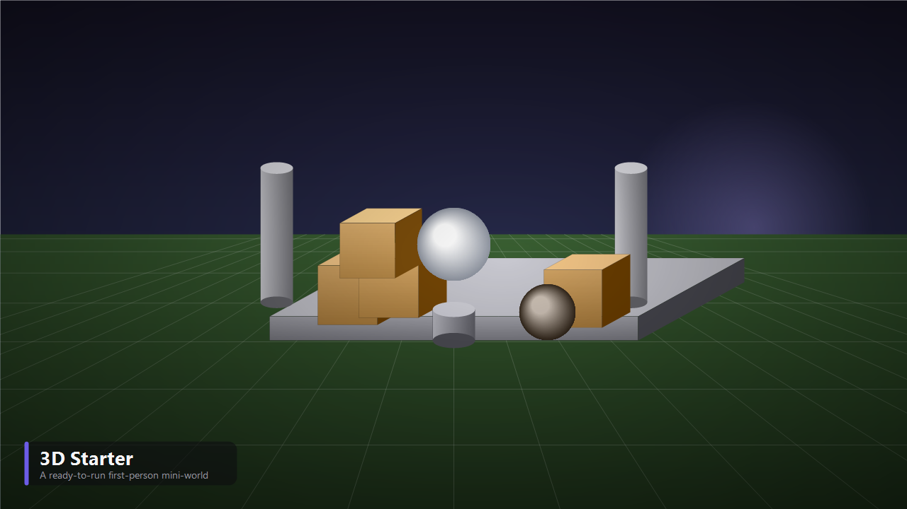

<div align="center">



# Vortex Engine — 3D Starter Template

### A ready-to-run first-person mini-world for the **[Vortex Engine](https://github.com/shadow-kernel/Vortex-Engine)**.

<br/>

[](https://github.com/shadow-kernel/Vortex-Engine)
[](LICENSE)
[](#-license--credits)
[](CREDITS.md)

<br/>

**Start screen. Options. A playable mini-world. All wired up, ready to build on.**

This is the default 3D template offered by Vortex Engine's **Create Project** dialog — a complete, ready-to-run starter you spawn into and can strip down or grow into your own game.

</div>

---

## ✨ What's in the box

| | |
|---|---|
| 🎬 **Cinematic start screen** | A polished lobby scene with a Play button, driven by a retained-mode UI screen (`.vui`) — not a placeholder. |
| ⚙️ **Options + pause menu** | A full options screen (video/audio/controls) and an in-game ESC pause menu, both built the same way your game's UI would be. |
| 🕹️ **First-person controller** | Keyboard + mouse **and** gamepad out of the box — WASD move, mouse/right-stick look, sprint, jump, crouch, adjustable FOV. Quake/Source-style crisp ground movement (real acceleration/friction, not lerp-mush). |
| 🌍 **A real mini-world** | Two scenes — `Lobby` (the start screen's 3D backdrop) and `Match` (the playable space) — dressed with Kenney furniture + nature assets and given real colliders (solid ground/walls, edge-accurate where it matters). |
| 🧩 **Collision demo** | A trigger volume + script showing Vortex's collision **events** (`OnTriggerEnter/Exit`) — touch it, it reacts. A working example to build "no-fly zones", hazards, or pickups from. |
| 🎨 **Procedural mascot + textures** | The template's own props (mascot, ground textures) are procedurally generated — zero unclear asset provenance. |

Everything here is **scripts you can read and change** (`Assets/Scripts/`) — none of this is hardcoded in the engine. Keep the whole framework (start screen → options → play) and just replace the world, or strip it down to nothing and start fresh.

---

## 🚀 Using this template

You don't clone this repo directly — it's pulled in automatically:

1. Open **Vortex Engine** → **Create Project**.
2. Pick **"3D Starter"**.
3. The engine fetches this template (as a git submodule) and creates your project from it.

Want to look at it standalone anyway (e.g. to contribute back)? Clone it like any repo:

```bash
git clone https://github.com/shadow-kernel/Vortex-Engine-3D-Template.git
```

You'll also need the [Vortex Engine](https://github.com/shadow-kernel/Vortex-Engine) itself to open and run it — see that repo's README for build instructions.

---

## 📂 Structure

```
Vortex-Engine-3D-Template/
├─ Assets/
│  ├─ Scenes/       Lobby.vscene (start screen) · Match.vscene (playable world)
│  ├─ Scripts/      Player/ (first-person controller) · Lobby/ (menu flow) · UI/ (screen logic)
│  ├─ UI/           HorrorLobby.vui · Options.vui · PauseMenu.vui — retained-mode screens
│  ├─ Models/       Kenney furniture + nature props (CC0)
│  ├─ Materials/    PBR materials for the world
│  ├─ Textures/     procedurally generated ground/prop textures (CC0)
│  ├─ Prefabs/      reusable entity presets
│  └─ Shaders/      any custom .hlsl shaders used by this template
├─ template.json    metadata shown in the engine's Create-Project dialog
└─ project.vortex   the Vortex project manifest
```

---

## 🤝 Contributing

This template is part of the open-source Vortex project — improvements, new demo
scripts, or a second starter world are all welcome. See the main engine's
**[CONTRIBUTING.md](https://github.com/shadow-kernel/Vortex-Engine/blob/main/CONTRIBUTING.md)**
and **[Code of Conduct](https://github.com/shadow-kernel/Vortex-Engine/blob/main/CODE_OF_CONDUCT.md)** —
the same rules apply here.

---

## 📄 License & Credits

This template's code (scripts, scenes, UI) is **MIT-licensed** — see **[LICENSE](LICENSE)**.
Every bundled asset is **CC0 (public domain)** or procedurally generated by the
authors — free to use for anything, including commercially, with no attribution
required. Full attribution: **[CREDITS.md](CREDITS.md)**.

---

<div align="center">

### 🌀 Part of [Vortex Engine](https://github.com/shadow-kernel/Vortex-Engine) — free & open source, forever.

</div>
